# **🥋 Reto 2: Par o Impar**

> Problema:
> Determinar si un número entero ingresado por el usuario es par o impar.

```pseudocode

  Inicio
  LEER número

  SI numero %2  == 0 ENTONCES
    IMPRIMIR el numero es par
  SI NO
    IMPRIMIR "El numero es impar"
  FIN_SI

```

```mermaid

flowchart TD
  A[Inicio] --> B[Leer número]
  B --> C{número % 2 == 0}
  C -->|Sí| D[Imprimir par]
  C -->|No| E[Imprimir impar]
  D --> F[Fin]
  E --> F


```


