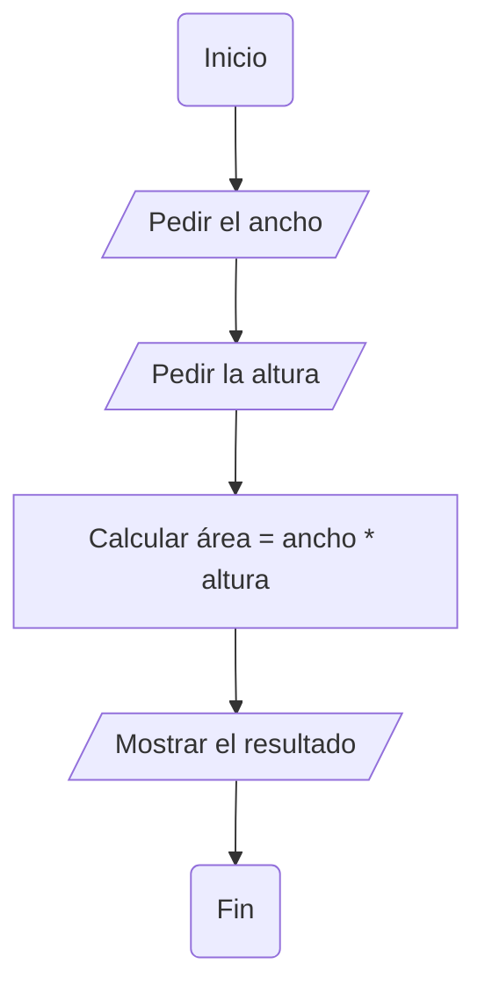

📋 Objetivos de la Secuencia
Escribir pseudocódigo claro, preciso y ordenado.

Dibujar diagramas de flujo que reflejen la misma lógica.

Comprender cuándo usar cada herramienta:

Pseudocódigo para describir ideas y algoritmos en texto.

Diagramas de flujo para visualizar la estructura de decisión y repetición.

Dominar estructuras lógicas básicas: secuencias, condicionales y bucles.

Claro, joven pupilo sanet:

**🥋 Reto 1 – Secuencia Simple**

> **Problema:**
> Calcular el área de un rectángulo dado su ancho y su altura.

**Tareas:**

1. **Pseudocódigo:**

   - Escribe los pasos de este algoritmo en un bloque de pseudocódigo Markdown (`pseudocode`), de forma clara y ordenada.

2. **Diagrama de flujo (Mermaid):**

   - Usa un bloque Mermaid en tu Markdown para representar gráficamente el flujo: inicio, entrada de datos, proceso de cálculo y salida.

3. **Reflexión breve:**

   - Explica en dos o tres líneas por qué aquí te sirve el pseudocódigo y qué aporta el diagrama de flujo.

---

tengo que calcular el area de un rectángulo dado su ancho y su altura.

```pseudocode
  //Calcular el area de un rectángulo

  //Paso 1 : iniciar.

  - Inicio del algoritmo

  //Paso 2 : Pedimos el Ancho
  Ancho = float o decimal
  Escribir "Cuanto Mide el Ancho ?"
  Guargar el dato en una caja llamada 'Ancho'.

  //Paso 3 : Pedimos la Altura
  Altura = float o decimal
  Escribir "Cuanto Mide la 'Altura'" .
  Guargar el dato en una caja llamada 'Altura' .

  //Paso 4 : Hacemos el cálculo
  //para calcular el Area es Area = base * Altura o en este caso Ancho * Altura

  Area = float o decimal
  Area = 0
  Area = Ancho * Altura
  Escribir "El area del rectángulo es 'Area'".

  // Paso 5 : Finalizar

  Fin.

```


